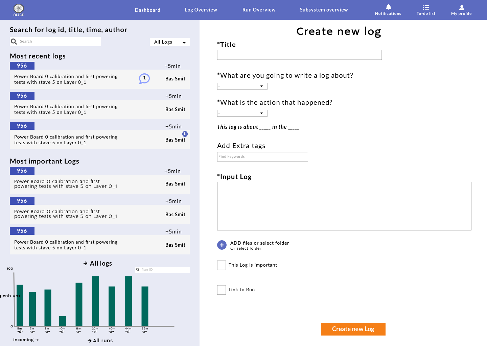

# Product Biografie

## Inhoud
- [Week 0](#Week0)
- [Week 1](#Week1)
- [Week 2](#Week2)
- [Week 3](#Week3)
- [Week 4](#Week5)
- [Week 5](#Week5)

## Week 0
*20-5*

Omdat dit project in samenwerking met de UX minor was begon ons project al in de laatste herkansingsweek van de webdev minor.
In deze week begonnen wij al met de (de)briefing van het project, het team leren kennen en het bepalen van de scope van het project.

Bij de briefing van het project op de maandag kwamen wij er achter dat de klant een ander beeld had van onze werkzaamheden dan wij zelf hadden. De klant had het beeld dat wij aan hun backlog zouden gaan werken en functies toevoegen in hun platform.
Ons beeld van het project was het dat wij bezig gingen met het ontwerp en de UX van het platform waar het team van ICT een start aan had gemaakt.

In deze week zijn wij toen bezig geweest met onderzoek naar het huidige en vorige platform dat bij cern gebruikt werd en hebben een plan gemaakt met de werkzaamheden waar wij ons mee bezig gingen houden om het platfrom plesurable te maken voor de gebruikers.

## Week 1
*27-5*

In deze week hebben wij ons plan om het platform te herontwerpen bij de opdrachtgever neergelegd in een presentatie met onze bevindingen.
Hierop kregen wij een positieve reactie van de klant.
De klant komt zelf meer van de technische kant en heeft zelf geen goed beeld van wat UX is en door deze meeting werd de waarde daarvan duidelijker en stemde hij in met het alternatieve plan.

Deze week zijn wij bezig gegaan samen met de UX-ers om onderzoek te doen naar het ALICE project en hoe het platform daar in past.

Marcel en ik zijn ook bezig geweest met het uitzoeken van de tech stack die de ICT-ers gekozen hadden voor de front-end van het platform.
Met het onderzoek merkte wij dat het voor ons een moeilijke stack zou zijn om op verder te werken door de keuze van talen en frameworks.
Door deze conclusie hebben wij besloten een eigen proof of concept demo te maken met onze eigen stack en zijn gaan uitzoeken wat hiervoor het beste was.

## Week 2
*03-06*

Deze week stond ook nog in het thema van onderzoek doen. We hebben contact gezocht met zoveel mogelijk mensen die bij CERN hebben gewerkt aan het ALICE project via linkedin en ander platformen om zo zoveel mogelijk gebruikers input mee te kunnen nemen.
Ook werden deze week de eerste wireframes opgeleverd door de UX-designers en zijn wij begonnen met het opzetten van een tech stack

#### Eerste stack
De eerste stack die wij samengesteld hebben bestond uit:

##### Server
- Node js with Express framework
	- Multer
	- body-parser
- Sessions
- Templating engine (hbs)
- Websockets socket io

##### Client
- Websockets (socket io)
- D3
- Material design

We hebben deze keuze gemaakt omdat het bestond uit voor ons bekende packages en frameworks.
Voor de server hadden we een basic express server met handlebars als templating engine en websockets voor realstime data distributie naar de Client.

Op de client hadden wij websockets voor het verwerken van realtime data en D3 voor het visualiseren van data op het dashboard.

Na overleg met onze UX-designers hebben wij besloten Material design te gebruiken als design system binnen het platform. Deze keuze is tot stand gekomen door de aard van het project. Het jiskefet project is een project dat een wisselende samenstelling heeft van teams die er aan werken, voornamelijk bestaand uit ICT studenten. Door de wisselende opstelling binnen het project is het wel belangrijk dat er consistentie en houvast is met een duidelijke documentatie voor de volgende teams.
Het zelf bouwen van een design system viel niet binnen onze scope van het project en daardoor hebben wij gekeken naar een bestaand design system met goede documentatie dat herkenbaar is voor gebruikers.
Ook is visuele identiteit niet heel belangrijk binnen dit platform, maar usabillity en herkenbaarheid is wel een belangrijke factor.

Na het uitwerken van het eerste prototype voor het projetc merkte wij dat deze stack misschien niet de beste keuze was voor het platform dat wij willen bouwen.
Dit lag eraan dat de flow van data etc. binnen handlebars en het schrijven van helper functies vrij omslachtig was voor de schaal van het project en hebben wij besloten om de volgende week de stack opnieuw door te denken.

## Week 3
*10-06*

In deze week kwamen er meer designs en wireframes binnen van onze UX-designers om uit te werken.

Na de conclusie van de vorige week over de tech stack zijn wij op zoek gegaan naar een andere setup die toepasselijk was voor het platform.
Redelijk snel kwamen wij tot de conclusie dat het werken met een component based framework het beste zou werken voor het samenstellen van het systeem.
Marcel kwam met de MERN stack dat staat voor:
- Mongo
- Express
- React
- Node

Deze stack bevat bijna alle delen die nodig waren binnen ons platform, maar deze stack is deprecated en er wordt daarvoor tegenwoordig vaak doorverwezen naar NEXT.js wat een package is dat Express, Node en React combineert voor server-side gerenderde React applicaties.

De nieuwe stack bestaat uit:
#### Server
- Next.js
- Socket.io

#### Client
- React
- React-dom
- Socket.io
- D3
- Material design als design system

Na het samenstellen van de stack hebben wij gekeken naar een userflow die wij wilde uitwerken voor het proof of concept prototype van jiskefet en hebben wij de pagina's verdeeld om uit te werken. Marcel heeft zich gefocust op het dashboard en ik ben bezig gegaan met de overview pagina's van de logs en runs en de flow van data door de components en applicatie

Deze week ben ik veel bezig geweest met het uizoeken van de flow van data tussen components en states binnen react en hoe ik dat kon beinvloeden. Dit bleek een vrij tijdrovend process te zijn met een hoge learningcurve, maar met gebruik van de documentatie goed uit te zoeken.

Nu het process van development echt begon te lopen kwam er een pijnpunt aan het licht waar wij zelf geen invloed op hebben. Bij het team van ICT blijken er constant problemen te onstaan met de API waardoor de flow van data niet betrouwbaar is. Bijna op dagelijkse basis begeeft de API en de data is niet compleet, hierdoor hebben wij de knoop doorgehakt en heeft Marcel een eigen API geschreven om een stabiele flow van data te hebben binnen de applicatie.

## Week 4
*17-06*

Deze week zij onze UX-desigers bezig gegaan met het testen van de wireframes met OA. eye-tracking om het design te valideren.

Op dinsdag hebben wij een call gehad met CERN en het team dat daar deze week zat om het project te bespreken. Bij de presentatie van het nieuwe ontwerp kwamen positieve reacties over het design, maar ook nog wat vragen en opmerkingen over bepaalde manieren waarop informatie weergegeven werd.

Voor het development zijn wij verder gegaan met de userflow verder uit te werken binnen het prototype en hebben wij nogmaals aangekaart bij de klant dat het niet betrouwbaar zijn van de API ons werk moeilijker maakt.

Tegen het einde van deze week waren de meeste functionaliteiten rond en kwam de focus op het samenvoegen van de verschillende delen van de applicatie.

## Week 5
*24-06*
